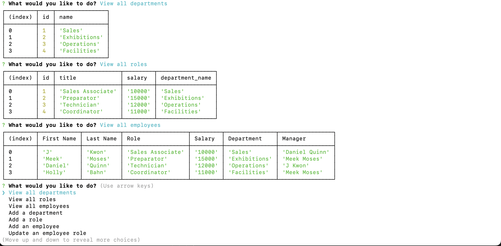

# employee_db 

## Description

A command-line application that can manage a company's employee database.

## Mock Up

## DEMO

<a href="https://drive.google.com/file/d/1MiNuobYonKLkzUohN6H0K3I-p0kfq5D_/view?usp=sharing">Link to DEMO video.</a>

## Installation

Copy this [SSH](git@github.com:Kwansom/employee_db.git) key to a directory on your computer.

## Usage

Access the directory on the command-line. Type "node index.js." Hit Enter and you will be prompted through the application.

## Questions

If you have any questions, please contact me at [wansom.kun@gmail.com](mailto:wansom.kun@gmail.com).
You can also find my projects at [GitHub - kwansom](https://github.com/kwansom).
